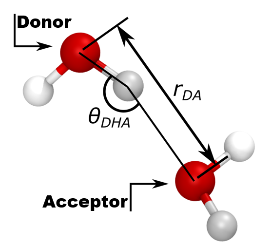

# Hydrogen Bond Calculation Modifier for OVITO

## Overview

This code provides a modifier for OVITO to calculate the number of hydrogen bonds and the average number of hydrogen bonds in a system. It is specifically designed for systems like water where hydrogen bonding plays a significant role.

---

## Usage


The modifier can be seamlessly integrated into OVITO's pipeline, similar to other built-in modifiers.

If your system uses different bond lengths or angle criteria, you can modify:
Donor-Acceptor bond length cut-off less than da_rcut.
Donor-H_atom_Acceptor angle should be higher than dha_rangle.

### Steps to Use the Modifier

1. Import the module:
   ```python
   from CalculateHydrogenBonds import CalculateHydrogenBonds
   ```
2. Append the modifier to your OVITO pipeline. For example, to calculate the number of hydrogen bonds in each frame, use the following code:
   ```python
   pipeline.modifiers.append(CalculateHydrogenBonds(donor=5, accep=3, H_atom=6, da_rcut=3.5, dha_rangle=150))
   ```
3. The modifier computes the global attributes:

Hbond_count: The total number of hydrogen bonds.
donor_count: The number of donor atoms.

### Example
	```python
	from ovito.io import import_file
	from CalculateHydrogenBonds import CalculateHydrogenBonds
	
	# Import trajectory file
	pipeline = import_file("trajectory_file.data")
	
	# Append the hydrogen bond calculation modifier
	donor_type = 5
	acceptor_type = 5
	H_type = 6
	
	pipeline.modifiers.append(CalculateHydrogenBonds(donor=donor_type, accep=acceptor_type, H_atom=H_type, da_rcut=3.5, dha_rangle=150))
	
	# Compute the pipeline and access results
	data = pipeline.compute()
	print("Hydrogen Bond Count:", data.attributes["Hbond_count"])
	print("Donor Atom Count:", data.attributes["donor_count"])
	```
	
### Limitations
## Particle Types:
The calculation depends on correctly assigned particle types for donors, acceptors, and hydrogen atoms (H_atom). Ensure your simulation data has these particle types accurately specified.

## Default Parameters:
The bond length between the donor and hydrogen atom is set to a default value of 1.0 Å. This value is suitable for water systems but can be changed in the source code if needed.
Water-Specific: The modifier is tailored for hydrogen bond calculations in water systems. Its applicability to other systems might require adjustments in the code.
